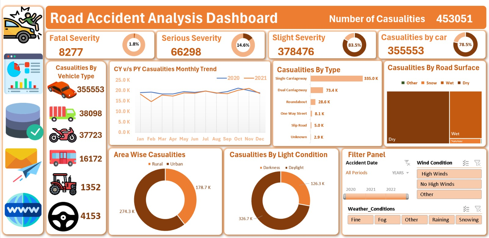

# 🚗 Road Accident Analysis Dashboard

> An interactive Excel-based data analytics project designed to analyze road accident casualties, severity, vehicle types, road conditions, environmental factors, and accident trends.

## 📊 Dashboard Preview

## 📌 Project Overview

The Road Accident Analysis Dashboard is an interactive data analytics project developed using Microsoft Excel. It transforms raw road accident data into meaningful visual insights through data cleaning, analysis, pivot tables, charts, KPIs, and interactive filters.

The dashboard provides a comprehensive view of accident casualties across different dimensions such as severity, vehicle type, road surface, area, light conditions, weather conditions, wind conditions, and monthly trends.

## 🎯 Project Objectives

- Analyze road accident casualty data
- Identify important accident trends and patterns
- Compare casualty severity levels
- Analyze casualties by vehicle type
- Understand the impact of road and environmental conditions
- Compare rural and urban casualty distribution
- Analyze monthly trends across different years
- Present complex data through an interactive dashboard

## 🛠️ Tools & Technologies

- Microsoft Excel
- Data Cleaning
- Data Analysis
- Pivot Tables
- Pivot Charts
- Excel Functions
- Interactive Filters / Slicers
- Data Visualization
- Dashboard Design

## 📈 Key Metrics

| Metric | Value |
|---|---:|
| Total Casualties | 453,051 |
| Fatal Severity | 8,277 |
| Serious Severity | 66,298 |
| Slight Severity | 378,476 |
| Casualties by Car | 355,553 |

## 🔍 Dashboard Analysis

### 1. Accident Severity
Analysis of Fatal, Serious, and Slight casualty categories.

### 2. Vehicle Type Analysis
Casualties are analyzed across cars, trucks, motorcycles, buses, agricultural vehicles, and other categories.

### 3. Monthly Casualty Trends
Year-over-year monthly trends help identify changes in casualty patterns.

### 4. Road Surface Analysis
Analysis across Dry, Wet, Snow, and Other road surface conditions.

### 5. Area-wise Analysis
Comparison of casualties between Rural and Urban areas.

### 6. Light Condition Analysis
Analysis based on Daylight and Darkness conditions.

### 7. Weather & Wind Conditions
Interactive filters allow exploration of casualties based on weather and wind conditions.

## 🧠 Skills Demonstrated

- Data Cleaning
- Data Analysis
- Microsoft Excel
- Pivot Tables & Pivot Charts
- Data Visualization
- Dashboard Development
- KPI Analysis
- Trend Analysis
- Data Storytelling
- Analytical Thinking

## 📂 Project Files

| File | Description |
|---|---|
| `Road Accident Dashboard.xlsx` | Main Excel dashboard |
| `road-accident-dashboard.jpeg` | Dashboard preview |

## 🚀 Project Outcome

This project demonstrates how raw accident data can be transformed into an interactive analytical dashboard using Microsoft Excel, making complex datasets easier to understand and helping identify meaningful trends and patterns.

## 👨‍💻 Author

**Nishant Tyagi**  
B.Tech — Computer Science & Engineering

Interested in **Data Analytics, Excel, SQL, Python and Data Visualization**.

---

⭐ If you find this project useful, feel free to explore the repository.
